# Guide Utilisateur - Site Oval Saône

Bienvenue sur le guide utilisateur du site de l'École de Rugby Oval Saône ! Ce document vous présente toutes les pages et fonctionnalités du site pour vous aider à naviguer et utiliser toutes ses fonctionnalités.

---

## Table des matières

1. [Présentation générale](#présentation-générale)
2. [Navigation](#navigation)
3. [Page d'accueil](#page-daccueil)
4. [L'École de Rugby](#lécole-de-rugby)
5. [Nos Équipes](#nos-équipes)
6. [Calendrier des événements](#calendrier-des-événements)
7. [Inscription](#inscription)
8. [Boutique](#boutique)
9. [Partenariat & Dons](#partenariat--dons)
10. [Contact](#contact)
11. [FAQ](#faq)

---

## Présentation générale

Le site de l'École de Rugby Oval Saône est le portail officiel du club. Il vous permet de :

- **Découvrir le club** : son histoire, ses valeurs et son équipe encadrante
- **Consulter les équipes** : les différentes catégories d'âge (U4 à U14) et leurs entraîneurs
- **Suivre les événements** : calendrier des matchs, tournois et entraînements
- **S'inscrire** : processus d'inscription complet pour rejoindre le club
- **Acheter des produits** : boutique officielle avec équipements et goodies
- **Devenir partenaire** : options de partenariat pour entreprises et particuliers
- **Contacter le club** : formulaire de contact et informations pratiques

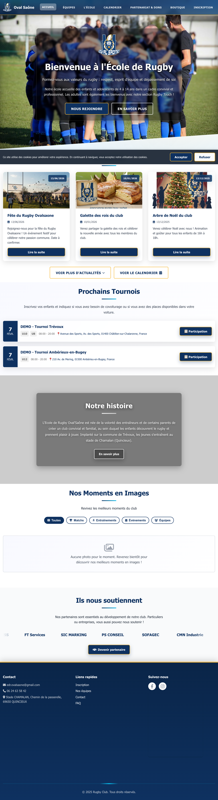
*Capture d'écran : Vue d'ensemble de la page d'accueil*

---

## Navigation

### Sur ordinateur

La navigation principale se trouve en haut de chaque page. Elle comprend les liens suivants :

| Lien | Description |
|------|-------------|
| **Accueil** | Page principale avec actualités, tournois et galerie |
| **Équipes** | Présentation des différentes catégories d'âge |
| **L'École** | Histoire du club, chiffres clés et bureau |
| **Calendrier** | Événements à venir par équipe |
| **Partenariat & Dons** | Sponsors et comment devenir partenaire |
| **Boutique** | Produits officiels du club |
| **Inscription** | Processus d'inscription et tarifs |

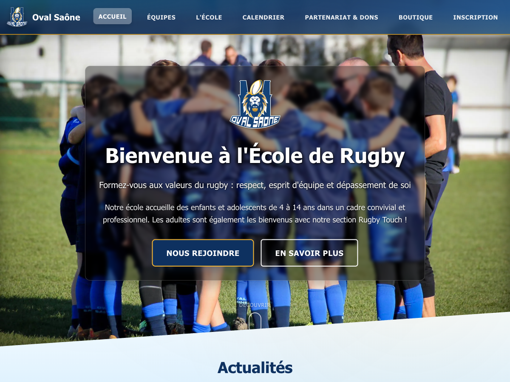
*Capture d'écran : Barre de navigation sur ordinateur*

### Sur mobile

Sur smartphone et tablette, le site s'adapte automatiquement avec :

- Un **menu hamburger** (☰) en haut à droite pour accéder à toutes les pages
- Une **barre de navigation rapide** en bas de l'écran avec 3 raccourcis :
  - 📅 **Calendrier** : accès rapide aux événements
  - 🏠 **Accueil** : retour à la page principale
  - ➕ **Inscription** : pour rejoindre le club

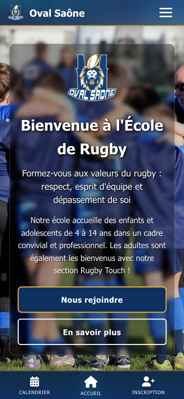
*Capture d'écran : Navigation sur mobile avec le menu et la barre inférieure*

---

## Page d'accueil

La page d'accueil est le cœur du site. Elle présente les informations essentielles du club.

### Section Hero

L'en-tête de bienvenue présente :
- Le logo du club
- Un message de bienvenue
- Les valeurs du club : respect, esprit d'équipe, dépassement de soi
- Deux boutons d'action :
  - **Nous rejoindre** → vers la page d'inscription
  - **En savoir plus** → vers la page de l'école

*Capture d'écran : Section hero de la page d'accueil*

### Actualités

Cette section affiche les **3 dernières actualités** du club. Chaque actualité comprend :
- Une image illustrative
- Un badge avec la date
- Un titre
- Un court extrait
- Un bouton **"Lire la suite"** pour voir l'article complet

💡 **Astuce** : Cliquez sur le bouton **"Voir plus d'actualités"** pour afficher les actualités précédentes.

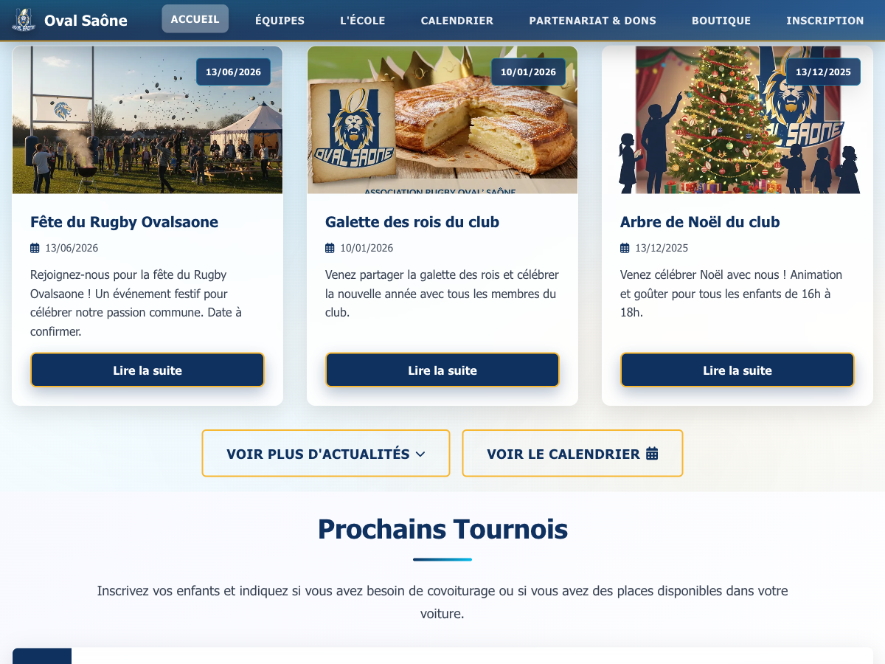
*Capture d'écran : Section actualités avec les 3 dernières news*

### Prochains Tournois

Cette section affiche automatiquement les **tournois à venir** dans les 2 prochaines semaines.

Pour chaque tournoi, vous pouvez voir :
- La date et l'heure
- Le lieu
- Les équipes concernées
- Un système de **covoiturage** pour coordonner les déplacements entre parents

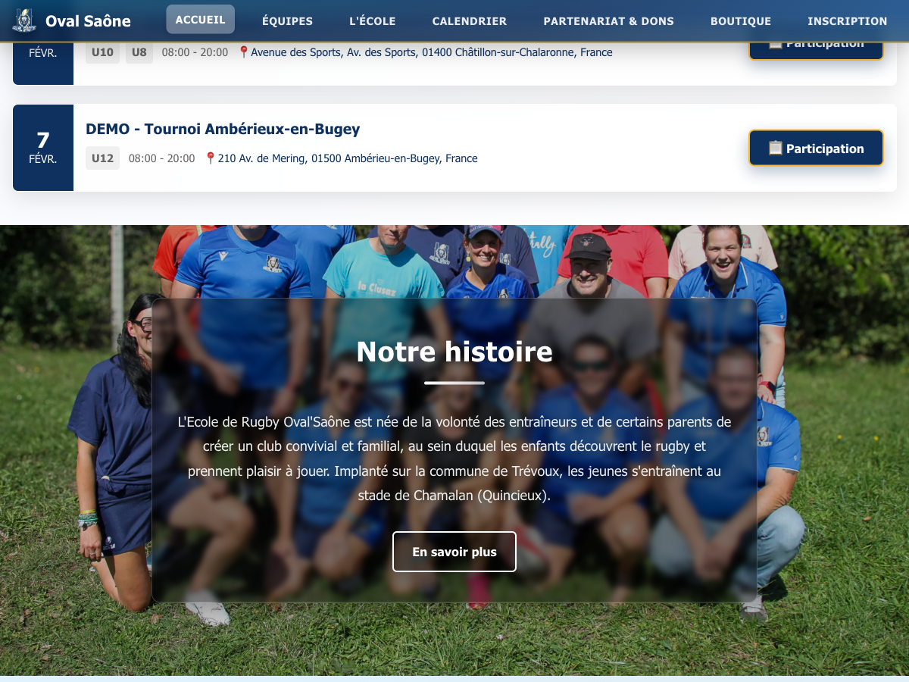
*Capture d'écran : Section des prochains tournois*

### Notre Histoire

Une section avec effet parallax présente brièvement l'histoire du club et sa philosophie.

### Galerie Photos

La galerie présente les **meilleurs moments** du club en images. Vous pouvez :

1. **Filtrer par catégorie** :
   - 🏆 Matchs
   - 🏃 Entraînements
   - 📅 Événements
   - 👥 Équipes
   - 📷 Toutes les photos

2. **Ouvrir un album** : Cliquez sur "Voir les photos" pour ouvrir la galerie complète d'un événement

3. **Naviguer dans les photos** :
   - Utilisez les flèches ← → pour passer d'une photo à l'autre
   - Appuyez sur **Échap** ou cliquez en dehors pour fermer

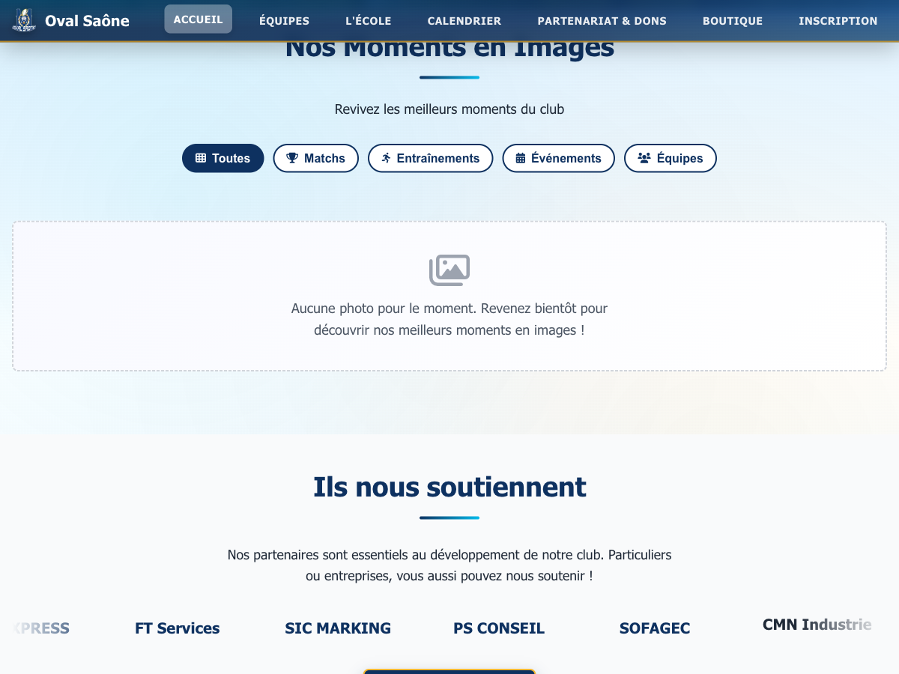
*Capture d'écran : Galerie photos avec les filtres par catégorie*

*Capture d'écran : Visualisation d'une photo en plein écran (lightbox)*

### Nos Sponsors

La section sponsors présente les partenaires qui soutiennent le club, avec leur logo et un lien pour en savoir plus.

---

## L'École de Rugby

**Accès** : Menu → L'École

Cette page présente en détail l'école de rugby.

### Notre Histoire

Découvrez comment est né le club et les valeurs qui nous animent :
- Un club ouvert à tous
- Le sport comme outil d'épanouissement
- Une grande famille

### L'École en Chiffres

Des statistiques concrètes sur le club :
- 👥 **101 licenciés actifs**
- 🏉 **6 équipes** (U4 à U14)
- 👨‍🏫 **12 éducateurs diplômés**
- 📅 **2 entraînements par semaine**
- 🏆 **15+ tournois par saison**
- 📍 **Créé en 2025**

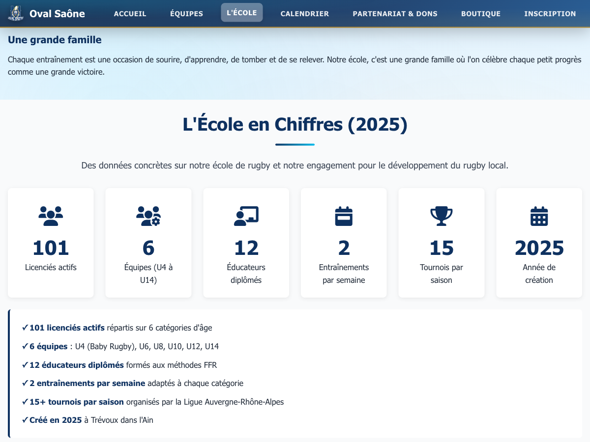
*Capture d'écran : Section des statistiques du club*

### Le Bureau

Présentation des membres du bureau avec :
- Photo
- Nom et fonction
- Description de leur rôle

### Les Éducateurs

Présentation des entraîneurs diplômés par catégorie d'âge.

---

## Nos Équipes

**Accès** : Menu → Équipes

Cette page présente toutes les catégories d'âge du club.

Pour chaque équipe, vous trouverez :
- **Nom de la catégorie** (U6, U8, U10, etc.)
- **Tranche d'âge** concernée
- **Nombre de joueurs**
- **Entraîneur(s)** responsables
- **Description** de la catégorie
- **Planning d'entraînement** avec jours et horaires

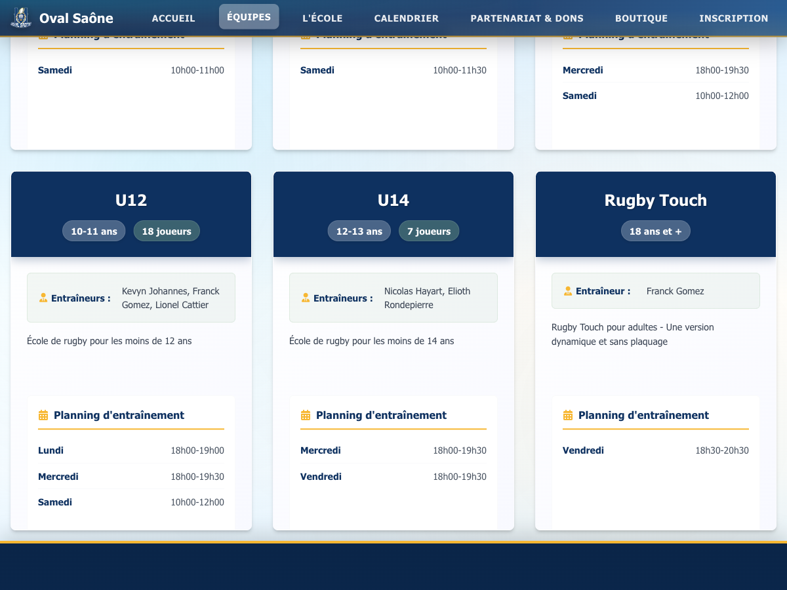
*Capture d'écran : Liste des équipes avec leurs informations*

### Les catégories

| Catégorie | Âge | Description |
|-----------|-----|-------------|
| **U4 (Baby Rugby)** | 4 ans | Découverte ludique du rugby |
| **U6** | 5-6 ans | Initiation aux bases |
| **U8** | 7-8 ans | Développement des fondamentaux |
| **U10** | 9-10 ans | Perfectionnement technique |
| **U12** | 11-12 ans | Apprentissage tactique |
| **U14** | 13-14 ans | Rugby structuré |
| **Rugby Touch** | Adultes | Rugby sans plaquage |

---

## Calendrier des événements

**Accès** : Menu → Calendrier

Cette page affiche tous les événements du club : matchs, tournois, entraînements spéciaux.

### Filtrer par équipe

Utilisez les **onglets** en haut pour filtrer les événements :
- **Tous les événements** : vue globale
- **U6, U8, U10...** : événements d'une équipe spécifique

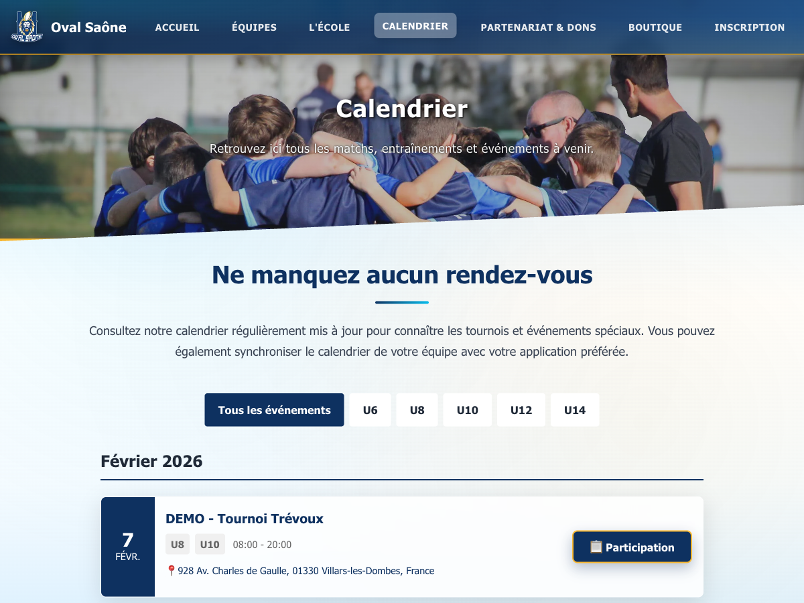
*Capture d'écran : Onglets de filtrage par équipe*

### Événements à venir

La liste des **événements futurs** s'affiche avec :
- 📅 Date et heure
- 📍 Lieu
- 📝 Description
- 🏉 Équipe concernée

### Événements passés

Cliquez sur **"Voir les événements passés"** pour consulter l'historique.

### Synchroniser le calendrier

Vous pouvez **ajouter le calendrier** à votre application préférée :

1. **Google Calendar** : Cliquez sur le bouton Google Calendar pour l'équipe souhaitée
2. **Format ICS** : Téléchargez le fichier ICS pour l'ajouter à Apple Calendar, Outlook, etc.

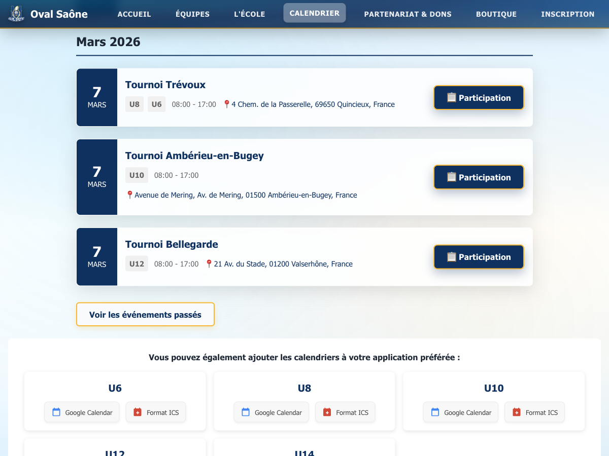
*Capture d'écran : Liens pour synchroniser les calendriers*

---

## Inscription

**Accès** : Menu → Inscription

Cette page détaille tout le processus pour inscrire votre enfant (ou vous-même pour le Rugby Touch).

### Pourquoi nous rejoindre ?

3 bonnes raisons :
- ▶️ **Séance d'essai gratuite** : Découvrez sans engagement
- ⏰ **Inscription en cours d'année** : Rejoignez-nous à tout moment
- 👥 **Encadrement bienveillant** : Éducateurs diplômés et attentionnés

### Les tarifs

| Catégorie | Tarif |
|-----------|-------|
| École de Rugby (U6 à U14) | **190€** |
| Baby Rugby (U4, nés en 2021) | **130€** |
| Rugby Touch Adultes (licence unique) | **110€** |
| Rugby Touch Adultes (licences multiples) | **90€** |

**Inclus dans le tarif :**
- Licence FFR
- Assurance
- Dotation annuelle (short, tee-shirt, chaussettes)

💡 **Réduction famille** : -25€ sur la 3ème licence !

*Capture d'écran : Section des tarifs d'inscription*

### Processus d'inscription

L'inscription se fait en **2 étapes** :

#### Étape 1 : Inscription sur Hello Asso

1. Cliquez sur le bouton **"S'inscrire sur HelloAsso"**
2. Créez votre compte ou connectez-vous
3. Remplissez le formulaire d'inscription
4. Procédez au paiement (ou choisissez le paiement au club)

*Capture d'écran : Bouton d'inscription HelloAsso*

#### Étape 2 : Inscription à la FFR

1. Vous recevrez un email de `ne_pas_repondre@ffr.fr`
   - ⚠️ **Important** : Conservez précieusement cet email !
2. Suivez le lien pour accéder au site OVAL-e
3. Téléchargez les documents requis :
   - ✅ Autorisation de soins (obligatoire)
   - ✅ Pièce d'identité (recto-verso sur une même page)
   - ✅ Photo d'identité (format JPEG)

### Documents requis

| Document | Détails |
|----------|---------|
| **Autorisation de soins** | Formulaire à télécharger et compléter |
| **Pièce d'identité** | CNI (recto-verso sur une page) ou passeport |
| **Photo d'identité** | Format JPEG |

---

## Boutique

**Accès** : Menu → Boutique

Découvrez notre boutique officielle avec tous les équipements et produits dérivés du club.

### Produits disponibles

Chaque produit affiche :
- 📷 Photo du produit
- 📝 Description
- 💰 Prix
- 📏 Tailles disponibles
- 🛒 Lien vers HelloAsso pour commander

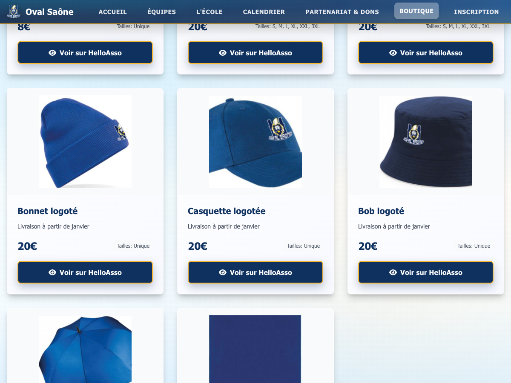
*Capture d'écran : Aperçu des produits de la boutique*

### Commander

Cliquez sur **"Voir sur HelloAsso"** ou sur le bouton **"Visiter notre boutique HelloAsso"** pour accéder à la boutique complète et passer commande.

**Avantages :**
- 🚚 Livraison gratuite dès 50€
- ↩️ Retour gratuit sous 14 jours
- 🔒 Paiement 100% sécurisé

---

## Partenariat & Dons

**Accès** : Menu → Partenariat & Dons

### Nos Sponsors

Découvrez les entreprises et particuliers qui soutiennent le club. Chaque sponsor est présenté avec :
- Logo
- Description
- Site web
- Date de partenariat

### Devenir partenaire

#### Pour les entreprises

Avantages du partenariat :
- 🏟️ **Visibilité au stade** : Logo affiché lors des matchs
- 💼 **Networking local** : Réseau d'entreprises partenaires
- 🌟 **Image de marque** : Association aux valeurs sportives
- 📱 **Présence digitale** : Mise en avant sur le site et réseaux sociaux
- 🤝 **Engagement local** : Soutien au sport régional
- 💰 **Avantages fiscaux** : Déduction de 60% du don (IS)

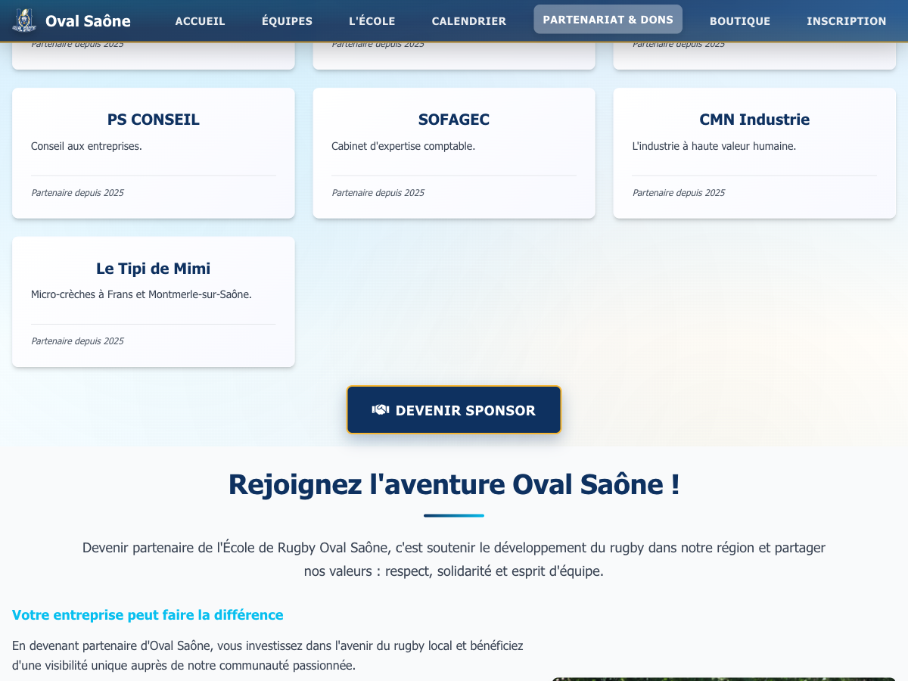
*Capture d'écran : Avantages pour les entreprises partenaires*

#### Pour les particuliers

Avantages du don :
- ❤️ **Soutien au sport local**
- 🎫 **Invitations privilégiées** aux événements
- 👕 **Goodies exclusifs**
- 📧 **Newsletter privilège**
- 🏆 **Reconnaissance** sur le mur des donateurs
- 💰 **Réduction d'impôt** de 66%

### Faire un don

Cliquez sur le bouton **"Faire un don"** pour être redirigé vers HelloAsso et effectuer votre don en ligne de manière sécurisée.

---

## Contact

**Accès** : Menu → Inscription → Lien "Contact" ou Footer

### Formulaire de contact

Remplissez le formulaire pour nous contacter :

1. **Nom** (obligatoire)
2. **Prénom** (obligatoire)
3. **Email** (obligatoire)
4. **Téléphone** (optionnel)
5. **Sujet** (obligatoire)
6. **Message** (obligatoire)

Cliquez sur **"Envoyer"** - vous recevrez une confirmation.

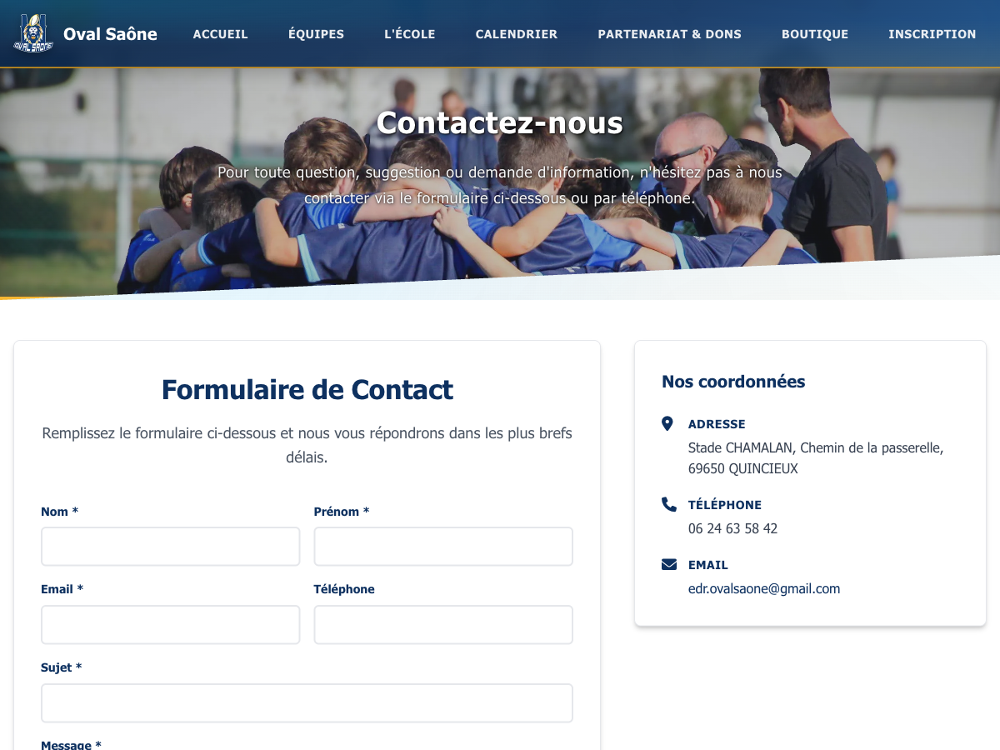
*Capture d'écran : Formulaire de contact*

### Coordonnées

- 📍 **Adresse** : Chemin de la passerelle, 69650 Quincieux
- 📞 **Téléphone** : 06 83 62 27 10
- ✉️ **Email** : edr.ovalsaone@gmail.com

### Carte de localisation

Une carte interactive affiche l'emplacement du **Stade Municipal de Chamalan** à Quincieux.

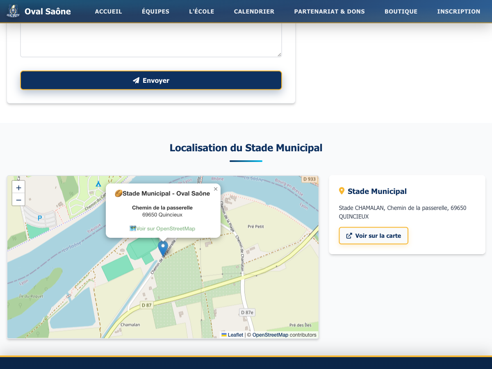
*Capture d'écran : Carte de localisation du stade*

---

## FAQ

**Accès** : Footer → FAQ

La Foire Aux Questions répond aux questions les plus fréquentes organisées par thème :

### Catégories de questions

| Catégorie | Questions couvertes |
|-----------|---------------------|
| ➕ **Inscription** | Âge minimum, inscription en cours d'année, filles acceptées, documents |
| 💰 **Tarifs & Équipement** | Coût, équipement fourni, équipement à prévoir |
| 🏃 **Pratique & Entraînements** | Lieu, horaires, expérience requise, séance d'essai, tournois |
| 🛡️ **Le Club** | Philosophie, nombre de joueurs, affiliation FFR, section adultes, assurance |
| ✉️ **Contact** | Moyens de contact |

### Utilisation

1. Cliquez sur une **catégorie** pour déplier les questions
2. Cliquez sur une **question** pour voir la réponse
3. Les réponses contiennent souvent des liens vers les pages concernées

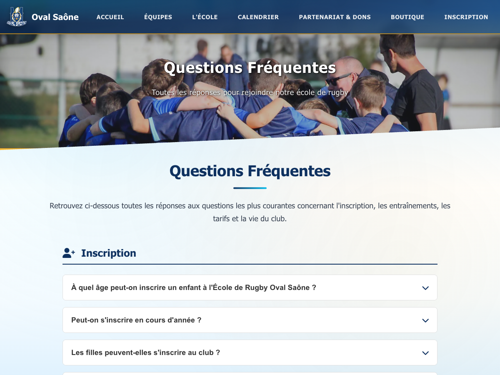
*Capture d'écran : Page FAQ avec les catégories de questions*

---

## Bandeau cookies

Lors de votre première visite, un bandeau s'affiche pour vous informer de l'utilisation des cookies :
- **Accepter** : Le site mémorise vos préférences
- **Refuser** : Navigation sans cookies non essentiels

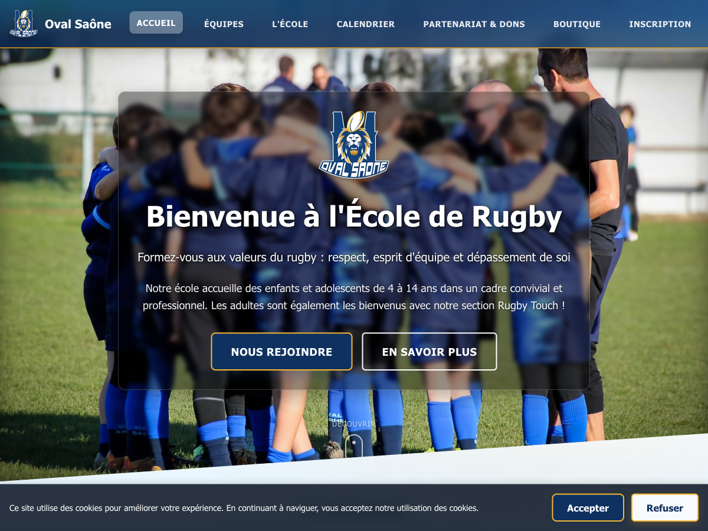
*Capture d'écran : Bandeau d'information sur les cookies*

---

## Réseaux sociaux

Retrouvez-nous sur les réseaux sociaux (liens dans le footer) :
- 📸 **Instagram** : @ovalsaone
- 👥 **Facebook** : École de Rugby Oval Saône

---

## Besoin d'aide ?

Si vous rencontrez des difficultés ou avez des questions :

1. Consultez d'abord la [FAQ](#faq)
2. Utilisez le [formulaire de contact](#contact)
3. Appelez-nous au **06 83 62 27 10**
4. Écrivez-nous à **edr.ovalsaone@gmail.com**

---

*Documentation mise à jour le 5 février 2026*
